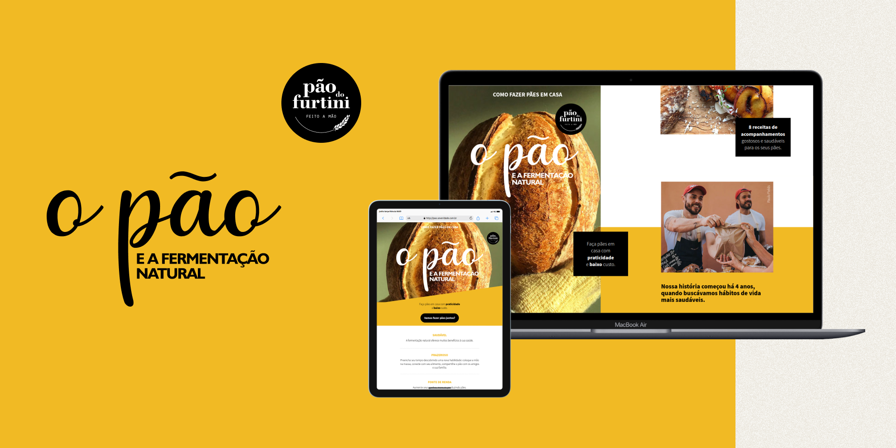

# Pão do Furtini - Landing page para venda de e-book

Há cerca de 3 anos, criei esta landing page, um trabalho que ainda hoje me traz satisfação. Ao olhar para trás, percebo claramente como meu conhecimento e habilidades evoluíram. Aprecio especialmente os resultados alcançados naquela época, como a implementação de animação de pré-carregamento, responsividade e a aplicação de estratégias de SEO.

Naquela época, eu ainda não conhecia o React e a lógica de componentes, muito menos o versionamento de código no GitHub. O uso de APIs parecia algo de outro mundo para mim. No entanto, cada desafio superado nesse projeto foi uma oportunidade valiosa de aprendizado. Implementei o Hotjar para monitorar como os usuários acessavam a página, o que foi fundamental para entender melhor suas interações. Para uma página de vendas, também foi crucial implementar o Google Analytics, permitindo a análise do comportamento dos visitantes e a otimização da experiência.

Olhando para trás, percebo o quanto um pequeno passo como o versionamento de código foi importante. Na época, tinha receio de perder partes essenciais durante o desenvolvimento, refletindo-se em meu código repleto de trechos comentados.

Fico feliz em constatar que estou em constante aprendizado, sempre buscando novas maneiras de melhorar a experiência do usuário e a performance dos meus projetos, especialmente no desenvolvimento web, com foco principal no frontend. Minha jornada até aqui tem sido marcada por dedicação e paixão em criar interfaces dinâmicas e intuitivas.